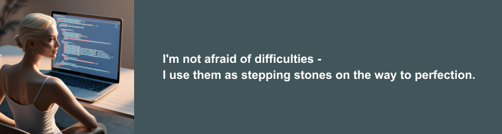

 
 <h1>Maryna's GitHub Profile</h1> 
 

## I'm not afraid of difficulties - I use them as stepping stones on the way to perfection.

**Email:** korbet.maryna.developer@gmail.com  
**Telegram:** [@maryna_dev](https://t.me/maryna_dev)
